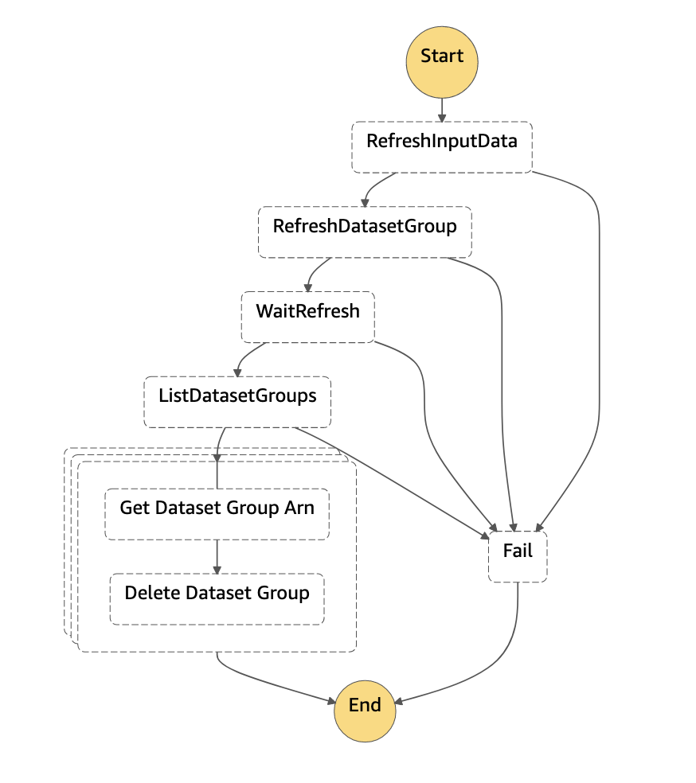

# Introduction

This repository contains 2 [AWS Serverless Application Model](https://aws.amazon.com/serverless/sam/) projects, each in its own folder:
- api - GetRecommendations, PutContent, PutEvents api  
- mlops - MLOps pipeline for [Amazon Personalize](https://aws.amazon.com/personalize/) Recommender System

# High level Architecture Diagram 


# Deployment steps

1. Global prerequisite
2. MlOps pipeline
3. API pipeline


## 1. Global prerequisite
Global prerequisite items required for both mlops and api projects deployment.

### Create S3 bucket for SAM artifacts
To deploy SAM models we need to create private [Amazon S3](https://aws.amazon.com/s3/) bucket

1. [In CloudShell]: Update default role for API gateway on account level. This operation need to be executed only once per account.
```bash
aws_account_id=`aws sts get-caller-identity --query 'Account' --output text`
aws iam create-role \
--role-name AmazonAPIGatewayPushToCloudWatchLogs \
--assume-role-policy-document file://apigateway-policy.json
aws iam attach-role-policy \
--role-name AmazonAPIGatewayPushToCloudWatchLogs \
--policy-arn "arn:aws:iam::aws:policy/service-role/AmazonAPIGatewayPushToCloudWatchLogs"

aws apigateway update-account --patch-operations op='replace',path='/cloudwatchRoleArn',value='arn:aws:iam::${aws_account_id}:role/AmazonAPIGatewayPushToCloudWatchLogs'
```
### Install requirement tools 

Install required for deployment tools:

- [SAM CLI](https://aws.amazon.com/cli/)

### Clone project repo 
1. Start an AWS CloudShell session from the AWS console
1. Clone the project repo:
```bash
git clone https://github.com/globeandmail/tgam-aws-personalize
```


## 2. MLOps pipeline 
This pipeline builds and manages a User-Personalization and a Similar-Items Amazon Personalize campaign from end to end. The pipeline uses AWS Serverless Application Model (SAM) to deploy multiple AWS Step Functions workflows, introduced below.

### Special Note About Input Data
Currently input data gathering is not managed by IAC (Infrastructure as Code) but is rather created manually on Sophi's DS DEV account. It involves a scheduled state machine that scales up the `Sophi3ContentMetaData` DynamoDB table, initiates 2 AWS Glue jobs (one for Interactions dataset, and one for Items dataset), and scales the `Sophi3ContentMetaData` DynamoDB table back down at the end. We decided to keep this step this way because data scientists at Sophi can have full control over the input data for the Personalize campaigns. This makes it easier for data scientists to perform data validation and model improvements in the future. Related resource names/ARNs can be found below:

- Glue Crawlers (runs every day at 6:00 EST):
  - Interactions: `tgam_personalize_sophi_aux_crawler`
  - Items: `tgam-personalize-content-crawler`
- Glue Jobs:
  - Interactions: `tgam-personalize-sophi-aux-transform`
  - Items: `tgam-personalize-content-metadata-transform`
- Step Functions: `arn:aws:states:us-east-1:727304503525:stateMachine:tgam-personalize-data-refresh`
- Eventbridge Scheduler: `arn:aws:events:us-east-1:727304503525:rule/tgam-personalize-inputdata-refresh`
  - Current event schedule: `cron(0 12 * * ? *)` - everyday at 12:00 GMT
- S3 URI for output: `s3://tgam-personalize-dev-1950aa20/glue-job/`

The Glue Job scripts can be found in the [glue-job](/glue-job) folder. The exact filters and feature transformation logic can be found within.

### Model Deployment

Model deployment is performed through the `DeployStateMachine` state machine. To run the state machine, input datasets and a JSON config file need to exist in the S3 input bucket created by the SAM. Note that this state machine is automatically triggered whenever there's a change in the JSON config files in the S3 input bucket, or it can be manually triggered by the `tgam-personalize-mlops-dev-S3Lambda` Lambda function. Details of the state machine are described below:


Note that this state machine is capable of creating User Personalization, Similar Items, and Personalized Ranking solutions all in one go; the user may pick and specify the solutions they need in the JSON config file.

### Dataset Refresh

To avoid accumulating too much legacy data (note that Amazon Perosonalize has an internal limit of 750k items in the item catalog) in the Personalize solutions, we recommend performing a dataset refresh once every week. This can be achieved through the `RefreshStateMachine` state machine. It is triggered by the `S3LambdaRefreshStateMachine` lambda function, which is scheduled through an Eventbridge rule. The `RefreshStateMachine` state machine works in the following order:
1. Sync the latest dataset in the Glue Job output folder to the S3 input bucket created by the SAM pipeline
2. Create a new Amazon Personalize dataset group through `DeployStateMachine` state machine and increment version number by 1
3. Update the DynamoDB table with API settings with new dataset group. Note that at this stage traffic is equally split between existing campaigns and the new campaign
4. Delete all Amazon Personalize dataset groups with the same root name but lower version numbers through `DeleteAllDatasetGroupResources` state machine. This state machine also deletes entries in the DynamoDB table with API settings for the old campaigns
5. Once complete, all traffic will be directed to the new campaign in the new dataset group

The SAM deployment pipeline also sets up an Eventbridge rule (`sched-tgam-personalize-dev-refreshSchedule`) that triggers the `S3LambdaRefreshStateMachine` lambda function every Saturday at 6:00 GMT (`cron(0 6 ? * SAT *)`).

The below diagram showcases the `RefreshStateMachine` workflow:



### MLOps Pipeline Deployment steps 
This command will deploy CodePipieline that will deploy changes based on git repository
```bash
sh pipeline.sh -e dev -t mlops -p tgam-personalize -b development -d
```

### MLOps Manual Deployment steps

> **Information**: Steps 2-3 can be executed by running ./update.sh in mlops folder!
1. [In CloudShell]: Navigate into the *mlops* directory:
```bash
cd mlops
```
2. [In CloudShell]: Validate and build your SAM project Deploy your project. SAM offers a guided deployment option, note that you will need to provide your email address as a parameter to receive a notification.
```bash
./update_dev.sh
````
3. Navigate to your email inbox and confirm your subscription to the SNS topic
4. [In CloudShell]: Once deployed, the pipeline will create the **InputBucket** which you can find in the CloudFormation stack output. Use it to upload your CSV datasets using the following structure:
```bash
Items/              # Items dataset(s) folder
Interactions/       # Interaction dataset(s) folder
``` 
5. [In CloudShell]: Navigate into the *mlops* directory:
```bash
cd ~/mlops
```
[In CloudShell]: Upload the `params*.json` files to the **/config/tgam-personalize/${env}/ directory of the InputBucket**. This step will trigger the campaign creation step functions workflow.
- Note that future updates to the `params.json` file should follow the resource naming convention that uses the dataset group name as the prefix
```bash
export env="dev"
aws s3 cp ./config/tgam-personalize/${env} s3://<input-bucket-name>/config/tgam-personalize/${env}/
```
9. Navigate to AWS Step Functions to monitor the workflow (Optional). Once the workflow completes successfully (which might take a few hours), an email notification will be sent out.


## 3. Deploy Recommendations API


### Create ACM Certificate
1. To deploy API Gateway using custom domain we need to create [AWS Certificate Manager](https://aws.amazon.com/certificate-manager/) public certificate. Because validation require DNS changes outside access of cloudformation this step needs to be done manualy.
```bash
aws acm request-certificate --domain-name ${domain} --validation-method DNS
```

2. After creating request, retrieve information about required DNS changes for certificate validation:

```bash
aws acm describe-certificate --certificate-arn ${certificate_arn} --query 'Certificate.DomainValidationOptions' --output text
```
Example output:
```text
recoapi-ng-dev.theglobeandmail.com      recoapi-ng-dev.theglobeandmail.com      DNS     SUCCESS
RESOURCERECORD  _0131f324147dc2ca4e625bb893dab9a8.recoapi-ng-dev.theglobeandmail.com.   CNAME   _e9c52b2278af465113fe7ac4f91008c8.snmnbsbtgy.acm-validations.aws.
```
3. When DNS changes are propagated confirm that certificate status is "ISSUED"
```bash
aws acm describe-certificate --certificate-arn ${certificate_arn} --query 'Certificate.Status'
```

### API Pipeline Deployment steps
This command will deploy CodePipieline that will deploy changes based on git repository from branch development
```bash
sh pipeline.sh -e dev -t api -p tgam-personalize -b development -d
```

### API Manual Deployment steps

1. [In CloudShell]: Navigate into the *api* directory:
```bash
cd api
```
2. [In CloudShell]: Validate, build, and deploy your project. SAM offers a guided deployment option, note that you will need to provide your email address as a parameter to receive a notification.
```bash
./update_dev.sh
```

3. Request DNS change for domain ng-dev.theglobeandmail.ca to point to CNAME record provided by API Gateway

4. [In CloudShell]: Test api:
```bash
export api_endpoint=(url from output url)
export api_key=(api from output url)

  curl ${api_endpoint}/dev/recommendations \
  -H 'authority: recoapi-prd.theglobeandmail.ca' \
  -H 'content-type: application/json' \
  -H "x-api-key: ${api_key}" \
  --data-raw '{"sub_requests":[{"widget_id":"recommended-art_same_section_mostpopular","include_read":false,"include_content_types":"wire,news,blog,column,review,gallery","limit":10,"context":"art_same_section_mostpopular","width":"w620","include_sections":"canada","min_content_age":61,"platform":"desktop","max_content_age":345601,"rank":1,"last_content_ids":"4LTZGA2T7FA5FC3XJXTHCUGXLI","newsletter_ids":"","section":"/canada/","seo_keywords":"","visitor_type":"anonymous"}],"platform":"desktop","visitor_id":"42ed07db-c4d5-41e6-8e51-5173da2bfec0","hash_id":""}'  | jq
```

# API/Lambda documentation

This solution will provide 3 [AWS Lambda](https://aws.amazon.com/lambda/) functions that will be processing Sophi data:
- PutEvent - AWS Lambda to transfer information about events from **sophi3-transformed-event-stream** [Amazon Kinesis Data Streams](https://aws.amazon.com/kinesis/data-streams/)
- PutContent -  AWS Lambda to transfer information about content changes from **sophi3-unified-content-stream** [Amazon Kinesis Data Streams](https://aws.amazon.com/kinesis/data-streams/)
- GetRecommendations - AWS Lambda published in backend of [Amazon API Gateway](https://aws.amazon.com/api-gateway/) to provide recommendation api for end users

All 3 Lambda Functions using Dynamo Table **${prefix}-${env}-api-settings** for example **tgam-personalize-dev-api-settings** that specify where APIs should send requests.

Items in table should have values:
1. name - uniq name of entry, should be equal to DatasetGroupName 
2. status - status of entry, "active" is used as filter on all table queries
3. eventTrackerId - id f event tracker where putEvent lambda will send future events
4. datasetArn - ARN of dataset with ITEMS where putContent Lambda will send updates related with content
5. trafficRatio - INT 0-100 that is used to decide what % of traffic getRecommendation Lambda will send to this 
6. campaignArn - ARN for campaign used by getRecommendation Lambda
7. context - dictionary of mapping between API context and personalize filters
   1. key - default/context name
   2. value.filter_name - name of prefix
   3. value.filter_values - list of values needed by filter
   4. value.include_time_range_for_sections - list of sections/categories where we will limit time limit for filters
   5. value.limit_time_range - true/false - if this filter by default use time limits or no 

Example of item in table:
```json
{
  "name": {
    "S": "tgam-personalize-dev-blue"
  },
  "status": {
    "S": "active"
  },
  "context": {
    "M": {
      "default": {
        "M": {
          "filter_name": {
            "S": "tgam-personalize-green-unread"
          }
        }
      },
      "art_same_section_mostpopular": {
        "M": {
          "filter_days_limit": {
            "S": "1"
          },
          "filter_values": {
            "L": [
              {
                "S": "category"
              }
            ]
          },
          "filter_name": {
            "S": "tgam-personalize-green-category"
          }
        }
      }
    }
  },
  "eventTrackerId": {
    "S": "2b695492-5212-42fc-9dbd-91aa56711957"
  },
  "trafficRatio": {
    "N": "100"
  },
  "datasetArn": {
    "S": "arn:aws:personalize:us-east-1:727304503525:dataset/tgam-personalize-blue/ITEMS"
  }, 
   "campaignArn": {
      "S": "arn:aws:personalize:us-east-1:727304503525:campaign/tgam-personalize-green-userPersonalizationCampaign"
   }
}
```

## Put Event api documentation

## Put Content api documentation

## Get recommendation api documentation
| Settings   | Enviroment | Value | Comment |  
| ---------- | ---------- |------ | ------- |
| Domain                   | dev        | recoapi-ng-dev.theglobeandmail.com |          |
| Domain                   | dev        | recoapi-ng-prd.theglobeandmail.com |          |
| ProvisionedConcurrent    | dev        | 10  |          |
| ProvisionedConcurrent    | prd        | 100 |          |
| ThrottlingRateLimit      | dev        | 100 |          |
| ThrottlingRateLimit      | prd        | 200 |          |
| ThrottlingBurstLimit     | dev        | 200 |          |
| ThrottlingBurstLimit     | prd        | 400 |          |


### Request Fields
| Field Name   | Required | Type   | Default | Comment |  
| ------------ | -------- | ------ |-------- | ---------------------- |
| visitor_id   | **Required** | String |         | userID for personalize |
| hash_id      | Ignored  | String |         | was existing in old api |
| platform     | Ignored  | String |         | was existing in old api |
| sub_requests | **Required** | List of dictionary |         | this api will support only 1 request but we will keep format of list to maintain compatibility with old api |
| sub_requests\[0\].limit | Optional | Int| max: 500, default: 25 |  limit of items for recommendation 
| sub_requests\[0\].context | Optional | String | |  example: art_same_section_mostpopular, art_mostpopular, user_container_recommendations, mobile_art_morestories. Currently its mapped to filters in personelize api
| sub_requests\[0\].platform | Optional | String | | User platform. Existing types in model: Mobile, Desktop, Tablet. Api will use lower().capitalize() as its case sensitive field
| sub_requests\[0\].visitor_type | Optional | String | | Visitor type. Existing types in model: Anonymous, Subscribed, Registered. Api will use lower().capitalize() as its case sensitive field
| sub_requests\[0\].section | Optional | String |  | section, will be used as filter only if context is **art_same_section_mostpopular**. Api will split string by "/" and select 2 element to convert "/canada/" => "canada" and /canada/alberta" => "canada"
| sub_requests\[0\].last_content_ids | Optional | | | Current content ID, it will exlude this content from recommendations
| sub_requests\[0\].widget_id | Ignored | | | was existing in old api |
| sub_requests\[0\].include_read | Ignored | | | was existing in old api |
| sub_requests\[0\].include_content_types | Ignored | | | was existing in old api |
| sub_requests\[0\].width | Ignored | | | was existing in old api |
| sub_requests\[0\].include_sections | Ignored | | | was existing in old api |
| sub_requests\[0\].min_content_age | Ignored | | | was existing in old api |
| sub_requests\[0\].max_content_age | Ignored | | | was existing in old api |
| sub_requests\[0\].rank | Ignored | | | was existing in old api |
| sub_requests\[0\].newsletter_ids | Ignored | | | was existing in old api |
| sub_requests\[0\].seo_keywords | Ignored | | | was existing in old api |


Example of request data:

```json
{
  "sub_requests": [
    {
      "widget_id": "recommended-art_same_section_mostpopular",
      "include_read": false,
      "include_content_types": "wire,news,blog,column,review,gallery",
      "limit": 6,
      "context": "art_same_section_mostpopular",
      "width": "w620",
      "include_sections": "business",
      "min_content_age": 61,
      "platform": "desktop",
      "max_content_age": 345601,
      "rank": 1,
      "last_content_ids": "IBIPXDSTAVFNTMRN5FXZXJFKRI",
      "newsletter_ids": "",
      "section": "/business/",
      "seo_keywords": "",
      "visitor_type": "registered"
    }
  ],
  "platform": "desktop",
  "visitor_id": "82889d15-188b-41ae-bf20-33982546e7b5",
  "hash_id": ""
}
```

### Reply Fields

### Data convertion between dynamoDB and reply
| DynamoDB Table        | Field in DynamoDB  | Field in reply | Additional convertion | Comment | 
| --------------------- | ------------------ | -------------- | --------------------- |-------- | 
| Sophi3ContentMetaData | Byline             | byline | join list of string with separator ' and ' |  |
| Sophi3ContentMetaData | WordCount          | word_count | N/A |  |
| Sophi3ContentMetaData | ContentType        | content_type | N/A |  |
| Sophi3ContentMetaData | PublishedDate      | published_at | N/A |  |
| Sophi3ContentMetaData | UpdatedDate        | updated_at | N/A |  |
| Sophi3ContentMetaData | Section            | section_meta_title | N/A |  |
| Sophi3ContentMetaData | CanonicalURL       | url | N/A |  |
| Sophi3ContentMetaData | CreditLine         | credit | N/A |  |
| Sophi3ContentMetaData | ContentId          | content_id | N/A |  |
| Sophi3ContentMetaData | ContentType        | content_type | N/A |  |
| Sophi3ContentMetaData | ContentRestriction | protection_product | N/A |  |
| Sophi3ContentMetaData | ContentType        | content_type | N/A |  |
| Sophi3ContentMetaData | Label              | label | N/A |  |
| arc_content           | StoryRel           | story_rel | only url220 key from data | from sophi2  | |
| arc_content           | AuthorRel          | author_rel | only url220 key from data | from sophi2 | |
| arc_content           | PictureRel         | promo_image | copy from PictureRel only url220 key from data | from sophi2  | |

### Frontend fields requiremetns
| Field name | Type | Example | 
| ----------------- | -------------- |-------- | 
| published_at  |  String | 2021-10-20 06:00:00 |
| updated_at | String | 2021-10-20 06:00:00 |
| url | String | /canada/article-ontario-to-mail-out-new-property-assessments-after-next-provincial/ |
| title | String | Ontario to mail out new property assessments after next provincial election, sources say |
| deck | String | Two senior officials with two municipalities in the Greater Toronto Area say that the province is proposing to mail out 2022 property assessments to residents after the June 2 provincial election |
| byline | String | Chris Hannay and Jeff Gray |
| content_type | String | news |
| protection_product | String | yellow |
| label | String | Top Links |
| article.author_rel[0].url220 | String | https://www.theglobeandmail.com/resizer/IH6n5vARBLydpQBlwj6xHVlsk44=/220x0/smart/filters:quality(80)/s3.amazonaws.com/arc-authors/tgam/8d3dea3c-6a55-40bc-9a12-187ea6329b31.png |
| article.promo_image.urls["220"] | String | https://www.theglobeandmail.com/resizer/gtrV3TKZSo-O9-r6sNnvuXAn4SY=/220x0/smart/filters:quality(80)/cloudfront-us-east-1.images.arcpublishing.com/tgam/YDAY4VZRYRH5LGUHO3QMJXR6JA.JPG |
| article.picture_rel[0].url220 | String | https://www.theglobeandmail.com/resizer/gtrV3TKZSo-O9-r6sNnvuXAn4SY=/220x0/smart/filters:quality(80)/cloudfront-us-east-1.images.arcpublishing.com/tgam/YDAY4VZRYRH5LGUHO3QMJXR6JA.JPG |
