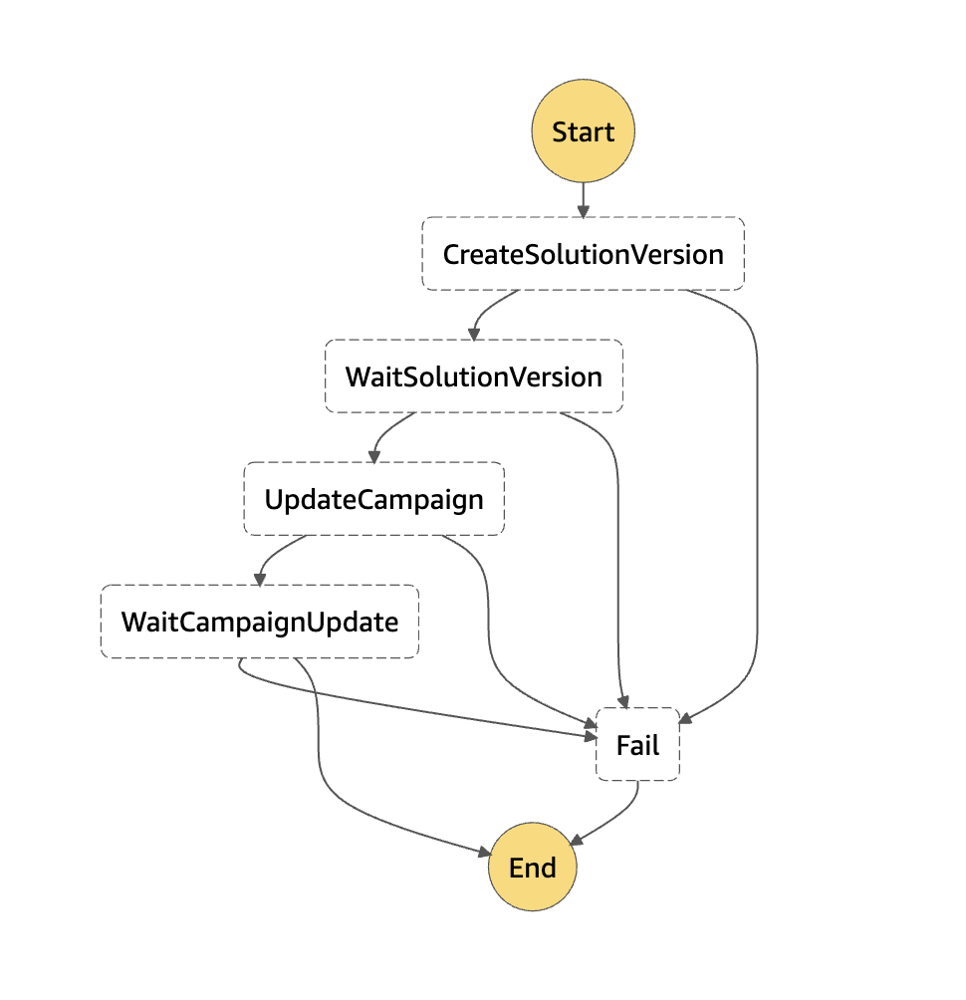

# Introduction


This repository contains 2 [AWS Serverless Application Model](https://aws.amazon.com/serverless/sam/) projects, every in each own folder:
- api - GetRecommendations, PutContent, PutEvents api  
- mlops - MLOps pipeline for [Amazon Personalize](https://aws.amazon.com/personalize/) Recommender System

# High level Architecture Diagram 


# Deployment steps

## Global prerequisite
Global prerequisite items required for both mlops and api projects deployment.

### Create S3 bucket for SAM artifacts
To deploy SAM models we need to create private [Amazon S3](https://aws.amazon.com/s3/) bucket

1. [In CloudShell]: Update default role for API gateway on account level. This operation need to be executed only once per account.
```bash
aws_account_id=`aws sts get-caller-identity --query 'Account' --output text`
aws iam create-role \
--role-name AmazonAPIGatewayPushToCloudWatchLogs \
--assume-role-policy-document file://apigateway-policy.json
aws iam attach-role-policy \
--role-name AmazonAPIGatewayPushToCloudWatchLogs \
--policy-arn "arn:aws:iam::aws:policy/service-role/AmazonAPIGatewayPushToCloudWatchLogs"

aws apigateway update-account --patch-operations op='replace',path='/cloudwatchRoleArn',value='arn:aws:iam::${aws_account_id}:role/AmazonAPIGatewayPushToCloudWatchLogs'
```
### Install requirement tools 

Install required for deployment tools:

- [SAM CLI](https://aws.amazon.com/cli/)

### Clone project repo 
1. Start an AWS CloudShell session from the AWS console
1. Clone the project repo:
```bash
git clone https://github.com/globeandmail/tgam-aws-personalize
```


## MLOps pipeline 
MLOps pipeline for Amazon Personalize Recommender System

This pipeline builds a User-Personalization Amazon Personalize campaign for Sophi from scatch, assuming input datasets have been pre-generated. The pipeline uses AWS Serverless Application Model (SAM) to deploy an AWS Step Functions workflow containing AWS Lambda functions that call Amazon S3, Amazon Personalize, and Amazon SNS APIs.

In addition, the pipeline also deploys a scheduled (weekly on Sunday morning) AWS Step Functions workflow that fully trains a new User-Personalization solution version with the latest data and updates the live campaign with the new solution version.

The below diagram describes the architecture of the solution:


The below diagram showcases the campaign creation step functions workflow:


The below diagram showcases the campaign update step functions workflow:



### Pipeline Deployment steps 
This command will deploy CodePipieline that will deploy changes based on git repository
```bash
sh pipeline.sh -e dev -t mlops -p tgam-personalize -b development -d
```

### Manual Deployment steps

> **Information**: Steps 2-3 can be executed by running ./update.sh in mlops folder!
1. [In CloudShell]: Navigate into the *mlops* directory:
```bash
cd mlops
```
2. [In CloudShell]: Validate and build your SAM project Deploy your project. SAM offers a guided deployment option, note that you will need to provide your email address as a parameter to receive a notification.
```bash
./update_dev.sh
````
3. Navigate to your email inbox and confirm your subscription to the SNS topic
4. [In CloudShell]: Once deployed, the pipeline will create the **InputBucket** which you can find in the CloudFormation stack output. Use it to upload your CSV datasets using the following structure:
```bash
Items/              # Items dataset(s) folder
Interactions/       # Interaction dataset(s) folder
``` 
5. [In CloudShell]: Navigate into the *mlops* directory:
```bash
cd ~/mlops
```
[In CloudShell]: Upload the `params.json` file to the **root directory of the InputBucket**. This step will trigger the campaign creation step functions workflow.
- Note that future updates to the `params.json` file should follow the resource naming convention that uses the dataset group name as the prefix
```bash
aws s3 cp ./params.json s3://<input-bucket-name>
```
9. Navigate to AWS Step Functions to monitor the workflow (Optional). Once the workflow completes successfully (which might take a few hours), an email notification will be sent out.


## Deploy Recommendations API


#### Create ACM Certificate
1. To deploy API Gateway using custom domain we need to create [AWS Certificate Manager](https://aws.amazon.com/certificate-manager/) public certificate. Because validation require DNS changes outside access of cloudformation this step needs to be done manualy.
```bash
aws acm request-certificate --domain-name ${domain} --validation-method DNS
```

2. After creating request, retrieve information about required DNS changes for certificate validation:

```bash
aws acm describe-certificate --certificate-arn ${certificate_arn} --query 'Certificate.DomainValidationOptions' --output text
```
Example output:
```text
recoapi-ng-dev.theglobeandmail.com      recoapi-ng-dev.theglobeandmail.com      DNS     SUCCESS
RESOURCERECORD  _0131f324147dc2ca4e625bb893dab9a8.recoapi-ng-dev.theglobeandmail.com.   CNAME   _e9c52b2278af465113fe7ac4f91008c8.snmnbsbtgy.acm-validations.aws.
```
3. When DNS changes are propagated confirm that certificate status is "ISSUED"
```bash
aws acm describe-certificate --certificate-arn ${certificate_arn} --query 'Certificate.Status'
```

#### First deployment
First deployment should be done after step function pipeline is finished and ssm parameters are available. To check parameters status run:
```bash
export enviroment="dev"
export resource_prefix="tgam-personalize"

aws ssm get-parameter --name /personalize/${resource_prefix}/${enviroment}/campaignArn
aws ssm get-parameter --name /personalize/${resource_prefix}/${enviroment}/campaignName
aws ssm get-parameter --name /personalize/${resource_prefix}/${enviroment}/datasetGroupName
aws ssm get-parameter --name /personalize/${resource_prefix}/${enviroment}/eventTrackerArn
aws ssm get-parameter --name /personalize/${resource_prefix}/${enviroment}/eventTrackerId
aws ssm get-parameter --name /personalize/${resource_prefix}/${enviroment}/minProvisionedTPS
```

If you want to create api before step functions finished with pipeline you need to create dummy parameters that will be updated during step function execution:
```bash
export enviroment="dev"
export resource_prefix="tgam-personalize"
aws_account_id=`aws sts get-caller-identity --query 'Account' --output text`
aws ssm put-parameter --name /personalize/${resource_prefix}/${enviroment}/campaignArn --value "arn:aws:personalize:us-east-1:${aws_account_id}:campaign/tgam-personalize" --type "String" 
aws ssm put-parameter --name /personalize/${resource_prefix}/${enviroment}/campaignName --value "tgam-personalize" --type "String" 
aws ssm put-parameter --name /personalize/${resource_prefix}/${enviroment}/datasetGroupName --value "tgam-personalize" --type "String" 
aws ssm put-parameter --name /personalize/${resource_prefix}/${enviroment}/eventTrackerArn --value "arn:aws:personalize:us-east-1:${aws_account_id}:event-tracker/12345678" --type "String" 
aws ssm put-parameter --name /personalize/${resource_prefix}/${enviroment}/eventTrackerId --value "8522dc75-1234-1234-1234-0317c07ab6f8" --type "String" 
aws ssm put-parameter --name /personalize/${resource_prefix}/${enviroment}/minProvisionedTPS --value "10" --type "String" 

```

### Pipeline Deployment steps
This command will deploy CodePipieline that will deploy changes based on git repository
```bash
sh pipeline.sh -e dev -t api -p tgam-personalize -b development -d
```

### Manual Deployment steps

1. [In CloudShell]: Navigate into the *api* directory:
```bash
cd api
```
2. [In CloudShell]: Validate, build, and deploy your project. SAM offers a guided deployment option, note that you will need to provide your email address as a parameter to receive a notification.
```bash
./update_dev.sh
```

3. Request DNS change for domain ng-dev.theglobeandmail.ca to point to CNAME record provided by API Gateway

4. [In CloudShell]: Test api:
```bash
export api_endpoint=(url from output url)
export api_key=(api from output url)

  curl ${api_endpoint}/dev/recommendations \
  -H 'authority: recoapi-prd.theglobeandmail.ca' \
  -H 'content-type: application/json' \
  -H "x-api-key: ${api_key}" \
  --data-raw '{"sub_requests":[{"widget_id":"recommended-art_same_section_mostpopular","include_read":false,"include_content_types":"wire,news,blog,column,review,gallery","limit":10,"context":"art_same_section_mostpopular","width":"w620","include_sections":"canada","min_content_age":61,"platform":"desktop","max_content_age":345601,"rank":1,"last_content_ids":"4LTZGA2T7FA5FC3XJXTHCUGXLI","newsletter_ids":"","section":"/canada/","seo_keywords":"","visitor_type":"anonymous"}],"platform":"desktop","visitor_id":"42ed07db-c4d5-41e6-8e51-5173da2bfec0","hash_id":""}'  | jq
```


# API/Lambda documentation

This solution will provide 3 [AWS Lambda](https://aws.amazon.com/lambda/) fucntions that will be processing Sophi data:
- PutEvent - AWS Lambda to transfer information about events from **sophi3-transformed-event-stream** [Amazon Kinesis Data Streams](https://aws.amazon.com/kinesis/data-streams/)
- PutContent -  AWS Lambda to transfer information about content changes from **sophi3-unified-content-stream** [Amazon Kinesis Data Streams](https://aws.amazon.com/kinesis/data-streams/)
- GetRecommendations - AWS Lambda published in backend of [Amazon API Gateway](https://aws.amazon.com/api-gateway/) to provide recommendation api for end users


## Put Event api documentation

## Put Content api documentation

## Get recommendation api documentation
| Settings   | Enviroment | Value | Comment |  
| ---------- | ---------- |------ | ------- |
| Domain                   | dev        | recoapi-ng-dev.theglobeandmail.com |          |
| Domain                   | dev        | recoapi-ng-prd.theglobeandmail.com |          |
| ProvisionedConcurrent    | dev        | 10  |          |
| ProvisionedConcurrent    | prd        | 100 |          |
| ThrottlingRateLimit      | dev        | 100 |          |
| ThrottlingRateLimit      | prd        | 200 |          |
| ThrottlingBurstLimit     | dev        | 200 |          |
| ThrottlingBurstLimit     | prd        | 400 |          |


### Request Fields
| Field Name   | Required | Type   | Default | Comment |  
| ------------ | -------- | ------ |-------- | ---------------------- |
| visitor_id   | **Required** | String |         | userID for personalize |
| hash_id      | Ignored  | String |         | was existing in old api |
| platform     | Ignored  | String |         | was existing in old api |
| sub_requests | **Required** | List of dictionary |         | this api will support only 1 request but we will keep format of list to maintain compatibility with old api |
| sub_requests\[0\].limit | Optional | Int| max: 500, default: 25 |  limit of items for recommendation 
| sub_requests\[0\].context | Optional | String | |  example: art_same_section_mostpopular, art_mostpopular, user_container_recommendations, mobile_art_morestories. Currently its mapped to filters in personelize api
| sub_requests\[0\].platform | Optional | String | | User platform. Existing types in model: Mobile, Desktop, Tablet. Api will use lower().capitalize() as its case sensitive field
| sub_requests\[0\].visitor_type | Optional | String | | Visitor type. Existing types in model: Anonymous, Subscribed, Registered. Api will use lower().capitalize() as its case sensitive field
| sub_requests\[0\].section | Optional | String |  | section, will be used as filter only if context is **art_same_section_mostpopular**. Api will split string by "/" and select 2 element to convert "/canada/" => "canada" and /canada/alberta" => "canada"
| sub_requests\[0\].last_content_ids | Optional | | | Current content ID, it will exlude this content from recommendations
| sub_requests\[0\].widget_id | Ignored | | | was existing in old api |
| sub_requests\[0\].include_read | Ignored | | | was existing in old api |
| sub_requests\[0\].include_content_types | Ignored | | | was existing in old api |
| sub_requests\[0\].width | Ignored | | | was existing in old api |
| sub_requests\[0\].include_sections | Ignored | | | was existing in old api |
| sub_requests\[0\].min_content_age | Ignored | | | was existing in old api |
| sub_requests\[0\].max_content_age | Ignored | | | was existing in old api |
| sub_requests\[0\].rank | Ignored | | | was existing in old api |
| sub_requests\[0\].newsletter_ids | Ignored | | | was existing in old api |
| sub_requests\[0\].seo_keywords | Ignored | | | was existing in old api |


Example of request data:

```json
{
  "sub_requests": [
    {
      "widget_id": "recommended-art_same_section_mostpopular",
      "include_read": false,
      "include_content_types": "wire,news,blog,column,review,gallery",
      "limit": 6,
      "context": "art_same_section_mostpopular",
      "width": "w620",
      "include_sections": "business",
      "min_content_age": 61,
      "platform": "desktop",
      "max_content_age": 345601,
      "rank": 1,
      "last_content_ids": "IBIPXDSTAVFNTMRN5FXZXJFKRI",
      "newsletter_ids": "",
      "section": "/business/",
      "seo_keywords": "",
      "visitor_type": "registered"
    }
  ],
  "platform": "desktop",
  "visitor_id": "82889d15-188b-41ae-bf20-33982546e7b5",
  "hash_id": ""
}
```

### Reply Fields

### Data convertion between dynamoDB and reply
| DynamoDB Table        | Field in DynamoDB  | Field in reply | Additional convertion | Comment | 
| --------------------- | ------------------ | -------------- | --------------------- |-------- | 
| Sophi3ContentMetaData | Byline             | byline | join list of string with separator ' and ' |  |
| Sophi3ContentMetaData | WordCount          | word_count | N/A |  |
| Sophi3ContentMetaData | ContentType        | content_type | N/A |  |
| Sophi3ContentMetaData | PublishedDate      | published_at | N/A |  |
| Sophi3ContentMetaData | UpdatedDate        | updated_at | N/A |  |
| Sophi3ContentMetaData | Section            | section_meta_title | N/A |  |
| Sophi3ContentMetaData | CanonicalURL       | url | N/A |  |
| Sophi3ContentMetaData | CreditLine         | credit | N/A |  |
| Sophi3ContentMetaData | ContentId          | content_id | N/A |  |
| Sophi3ContentMetaData | ContentType        | content_type | N/A |  |
| Sophi3ContentMetaData | ContentRestriction | protection_product | N/A |  |
| Sophi3ContentMetaData | ContentType        | content_type | N/A |  |
| Sophi3ContentMetaData | Label              | label | N/A |  |
| arc_content           | StoryRel           | story_rel | only url220 key from data | from sophi2  | |
| arc_content           | AuthorRel          | author_rel | only url220 key from data | from sophi2 | |
| arc_content           | PictureRel         | promo_image | copy from PictureRel only url220 key from data | from sophi2  | |

### Frontend fields requiremetns
| Field name | Type | Example | 
| ----------------- | -------------- |-------- | 
| published_at  |  String | 2021-10-20 06:00:00 |
| updated_at | String | 2021-10-20 06:00:00 |
| url | String | /canada/article-ontario-to-mail-out-new-property-assessments-after-next-provincial/ |
| title | String | Ontario to mail out new property assessments after next provincial election, sources say |
| deck | String | Two senior officials with two municipalities in the Greater Toronto Area say that the province is proposing to mail out 2022 property assessments to residents after the June 2 provincial election |
| byline | String | Chris Hannay and Jeff Gray |
| content_type | String | news |
| protection_product | String | yellow |
| label | String | Top Links |
| article.author_rel[0].url220 | String | https://www.theglobeandmail.com/resizer/IH6n5vARBLydpQBlwj6xHVlsk44=/220x0/smart/filters:quality(80)/s3.amazonaws.com/arc-authors/tgam/8d3dea3c-6a55-40bc-9a12-187ea6329b31.png |
| article.promo_image.urls["220"] | String | https://www.theglobeandmail.com/resizer/gtrV3TKZSo-O9-r6sNnvuXAn4SY=/220x0/smart/filters:quality(80)/cloudfront-us-east-1.images.arcpublishing.com/tgam/YDAY4VZRYRH5LGUHO3QMJXR6JA.JPG |
| article.picture_rel[0].url220 | String | https://www.theglobeandmail.com/resizer/gtrV3TKZSo-O9-r6sNnvuXAn4SY=/220x0/smart/filters:quality(80)/cloudfront-us-east-1.images.arcpublishing.com/tgam/YDAY4VZRYRH5LGUHO3QMJXR6JA.JPG |
